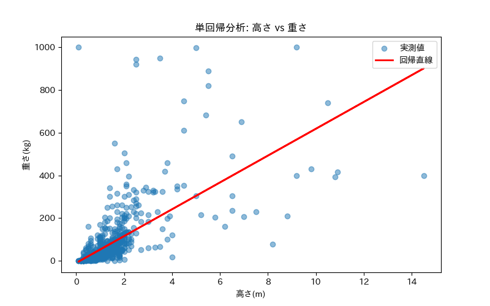
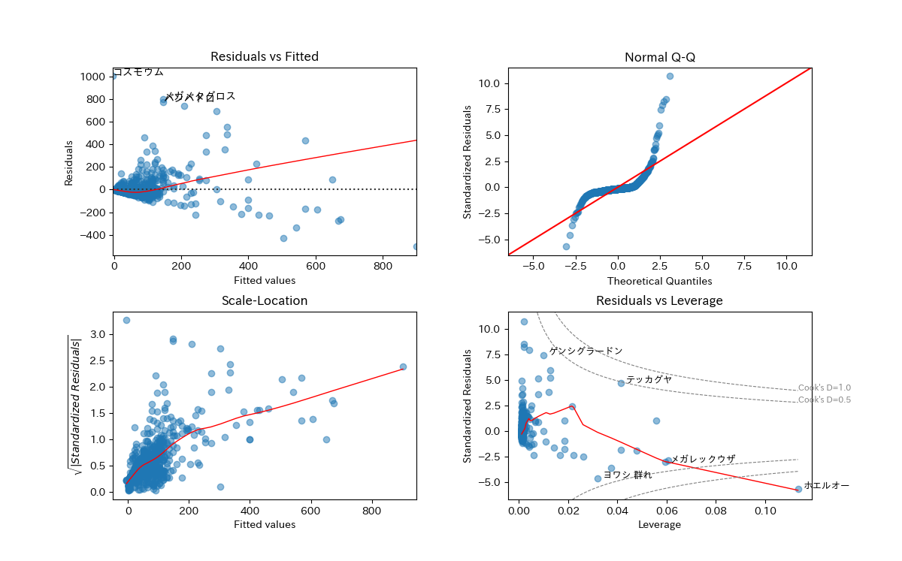
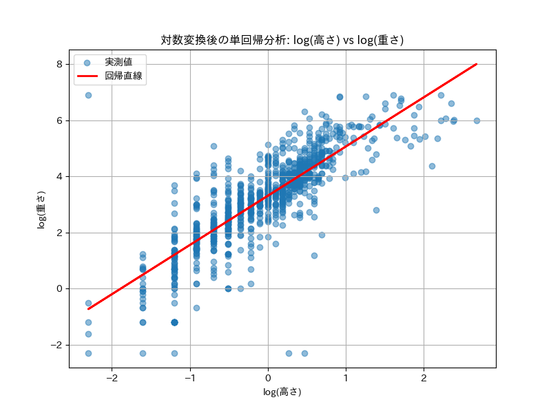
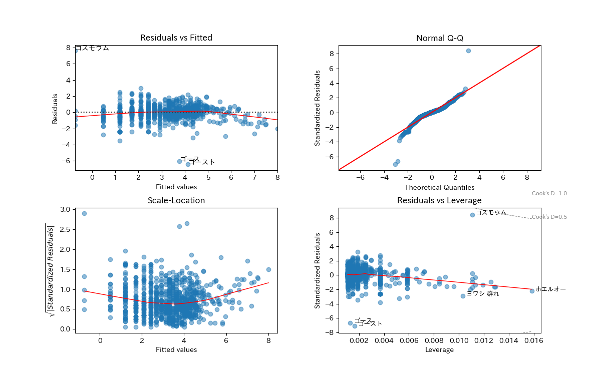

# ポケモンデータの単回帰分析 (Pokémon Linear Regression)

ポケモンの「高さ」と「重さ」のデータを用いて、Pythonで単回帰分析と回帰診断を行うスクリプトです。

## ファイルの概要

### 単回帰分析
* **`poke_linearmodel1.py`**
  * ポケモンの「高さ」を説明変数、「重さ」を目的変数とした通常の単回帰分析を行います。
  * 「大きいポケモンほど重い」という仮説を検証し、回帰直線と回帰診断図（Residuals vs Fitted, Normal Q-Q, Scale-Location, Residuals vs Leverage）を出力します。

### 両対数回帰分析
* **`poke_linearmodel2.py`**
  * 「体重は高さの3乗に比例する」という仮説に基づき、両変数を対数変換した上で両対数単回帰分析を行います（`log(高さ)` vs `log(重さ)`）。
  * よりデータにフィットしたモデルの検証と、外れ値（影響力の大きいポケモン）の確認を回帰診断図を通して行います。

## 使用している主なライブラリ
* `pandas`, `numpy` (データ加工)
* `statsmodels` (単回帰分析・回帰診断)
* `matplotlib`, `japanize_matplotlib`, `seaborn` (可視化)

## データの出典
データは [ポケモン種族値データ](http://blog.game-de.com/pokedata/pokemon-data/) より取得・加工して使用しています。

## 結果
### 単回帰分析
* `Y=-10.6+62.9x`
* 高さのP値 : `0.00`
* 決定係数 : `0.432`

#### 考察
P値は低かったものの、決定係数が0.4と少し低い値なのであまり説明力がない。QQプロットをみても当てはまりが悪いことが分かる。等分散性も低く、外れ値も多いように見える。

### 両対数単回帰分析
* `Y=3.31+1.76x`
* 高さのP値 : `0.00`
* 決定係数 : `0.671`

#### 考察
前回に比べて対数を置くと決定係数が0.671とかなり上昇した。両対数の関係ならば高さでポケモンの重さが説明できるとわかった。QQプロットでも当てはまりがよい。等分散性もあり、外れ値は減ったように見える。

